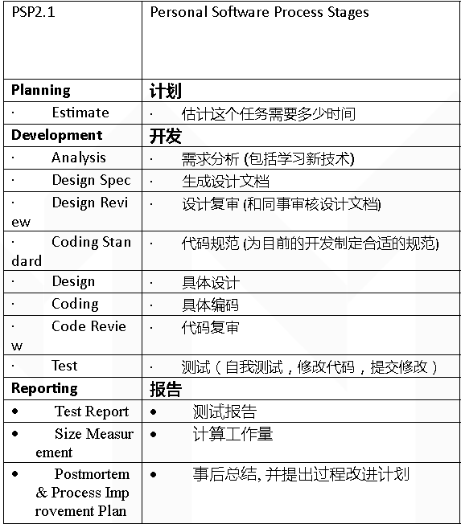

# Lesson 1
##1. 软件工程的定义
	+ 将系统化、规范化、可度量的方法应用于软件的开发、运行和维护的过程，即将工程化应用于软件中
	+ 如何将工程化应用于软件中的研究

## 2
###2.1 软件危机的定义  
随着计算机应用需求的驱动，系统软件和应用软件都有很大的发展。于此同时，也带来了软件开发成本的日益增长，开发进度难以控制，对用户需求不明确，软件产品的质量不可靠，软件的可维护度低，软件开发生产率跟不上硬件的发展和人们需求的增长等问题。使得大型软件的生产出现了很大的困难。  
其根本原因，有两点：1.软件的大量需求与软件生产力效率之间的矛盾。2.软件系统的复杂性与软件开发方法之间的矛盾

###2.2 COCOMO模型
构造性成本模型，是一种参数化的项目估算方法，参数建模是把项目的某些特征作为参数，建立一个数字模型预测项目成本。

## 3.软件生命周期
### 定义
软件的产生直到报废或停止使用的生命周期。软件生命周期包括可行性分析与开发计划、需求分析、设计、编码实现、测试、运行与维护等活动。
#### 六个阶段
##### 可行性分析与计划阶段
1.  确定软件开发的总体目标，给出功能、性能、可靠性以及接口等方面的要求，进行完成可行性分析
2. 估计可利用的资源、成本、效益、开发进度，进行投资-收益分析，指定开发计划
3.提交可行性分析报告、开发计划等文档

##### 需求分析阶段
1. 分析用户提出的要求，给出需求详细定义，确定软件系统的各项功能、性能需求和设计约束，确定对文档编制的要求
2. 提交软件需求说明、软件规格说明、数据要求说明等文档和初步的用户手册

##### 设计阶段
1. 概要设计：把各项需求转换成软件的体系结构。结构中每一组成部分都是意义明确的模块，每个模块都和某些需求相对应
2. 详细设计：对每个模块所要完成的工作进行具体的描述，提供源程序编写的直接依据
3. 提交结构设计说明、详细设计说明和测试计划初稿等文档

##### 实现阶段
1. 完成源程序的编码、编译和排错调试，得到没有语法错误的程序清单。程序结构良好、清晰易读，且与设计相一致
2. 编写进度日报、周报和月报
3. 提交用户手册、操作手册等面向用户的文档
4. 编制测试计划

##### 测试阶段
1. 全面测试目标软件系统，并检查审阅已编制的文档，提交测试分析报告。逐项评价所生产的程序、文档以及开发工作本身，提交项目开发总结报告

##### 运行与维护阶段
1. 软件提交给用户后，在运行使用中得到持续维护，根据用户新提出的需求进行必要且可能的扩充、删改、更新和升级
2. 软件维护包括该整形维护、适应性维护和完善性维护

## 4.UML设计的KA
### 软件需求
1. 软件需求基础
2. 需求过程
3. 需求获取
4. 需求分析
5. 需求规格说明
6. 需求确认
7. 实际考虑

### 软件设计
1. 软件设计基础
2. 软件设计关键问题
3. 软件结构与体系结构
4. 软件设计质量的分析与评价
5. 软件设计符号
6. 软件设计的策略和方法

## 5. CMMI五个级别
### Level 1
软件过程是无序的，有时甚至是混乱的，对过程几乎没有定义，成功取决于个人努力。

### Level 2
建立了基本的项目管理过程来跟踪费用、进度和功能特性。制定了必要的过程纪律，能重复早先类似应用项目取得的成功经验。

### Level 3
已将软件管理和工程两方面的过程文档化、标准化，并综合成该组织的标准软件过程。所有项目均使用经批准、剪裁的标准软件过程来开发和维护软件，软件产品的生产在整个软件过程是可见的。

### Level 4
分析对软件过程和产品质量的详细度量数据，对软件过程和产品都有定量的理解与控制。管理有一个作出结论的客观依据，管理能够在定量的范围内预测性能。

### Level 5
过程的量化反馈和先进的新思想、新技术促使过程持续不断改进。

## 6. 什么是CMMI
CMMI，即软件能力成熟度模型，是一个将目前正在使用的以及未来即将被发展出来的各种能力成熟度模型的，集成到一起的框架。这个框架是自动的、可扩展的。并且它消除了各个模型的差异性，减少了模型之间的重复性，增加了模型的透明度。从而能在总体上增强软件开发与改进的能力，使得企业能够按时地、不超出预算地开发出高质量的软件。

## PSP
### 各项指标

### 统计方法
在执行每个阶段时，进行计时。